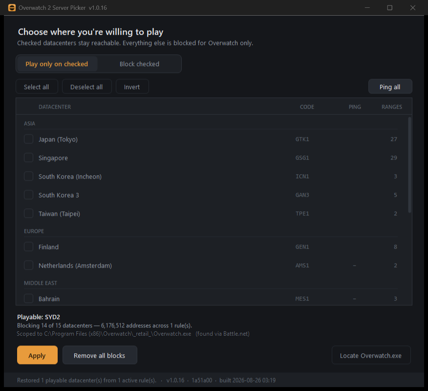

<div align="center">

# 🎯 Overwatch 2 Server Picker

**Stop getting thrown onto servers on the other side of the world.**

Tick the servers you want to avoid → press Apply → restart Overwatch. That's it.

[](https://github.com/egohero/ow2-server-picker/releases/latest/download/Ow2ServerPicker.zip)


[](LICENSE)
[](https://github.com/egohero/ow2-server-picker/releases)



</div>

---

## ⚠️ Read this first

> **Use entirely at your own risk.**
>
> This tool changes Windows Firewall rules to stop Overwatch reaching certain servers. It is a
> hobby project by a player, provided free, **with no warranty of any kind**.
>
> - 🚫 **Not affiliated with, endorsed by, or connected to Blizzard Entertainment** in any way.
> - 🎮 **Blizzard's Terms of Service broadly prohibit interfering with how the game operates.**
>   Firewall-based server blocking is widely used and we are not aware of anyone being banned
>   for it — but it is **not officially sanctioned**. If your account is actioned, suspended or
>   banned, that is on you.
> - 🌐 **It may break your connection.** Blocking too much can stop Overwatch connecting, or
>   crash it when joining a match. Click **Remove all blocks** to undo.
> - 📋 **The server list is community-guesswork.** Blizzard does not publish datacenter
>   addresses. Entries may be wrong, out of date, or block more than intended.
> - 🛡️ **It modifies your system firewall.** You are responsible for your own machine.
> - ⚖️ **The authors and contributors accept no liability** for bans, lost games, lost ranks,
>   downtime, connection problems, or any other damage arising from using this software. See
>   the [MIT License](LICENSE) — the software is provided *"as is", without warranty of any
>   kind*.
>
> **If you are not comfortable with all of the above, don't use it.**

---

## 📥 Download

### ➡️ [**Download Ow2ServerPicker.zip**](https://github.com/egohero/ow2-server-picker/releases/latest/download/Ow2ServerPicker.zip) ⬅️

Nothing to install first — no .NET, no runtime, no redistributables. One small program that
runs on any Windows 10 or 11 PC.

---

## 🚀 How to use it

| Step | What to do |
|:---:|---|
| **1** | **Unzip the file.** Right-click the download → *Extract All*. Don't run it from inside the zip. |
| **2** | **Double-click `install.cmd`.** Adds it to your Start Menu. Press a key when it says *Installed*. |
| **3** | **Press Start**, type *"Overwatch"*, open **Overwatch 2 Server Picker**. |
| **4** | **Click Yes** on the admin prompt. It needs this to change firewall rules — that's the only thing it uses admin for. |
| **5** | **Tick the servers you want to avoid.** Leave the mode on **Block checked**. |
| **6** | **Click Apply.** |
| **7** | **Fully quit Overwatch and restart it.** Changes don't apply to a running game. |

> 💡 **Not sure which servers are close to you?** Click **Ping all**. Lower numbers are closer —
> 🟢 green is good, 🔴 red is far away. Click any column heading to sort.

> 🛑 **Seeing a blue "Windows protected your PC" box?** That appears for any program without a
> code-signing certificate (they cost money). Click **More info** → **Run anyway**. Rather not?
> Skip `install.cmd` and just double-click `Ow2ServerPicker.exe` — same app, it just won't be
> in your Start Menu.

**To undo everything:** open the app → **Remove all blocks**.

---

## 🤔 Which mode should I use?

<table>
<tr><th width="50%">✅ Block checked <em>(recommended)</em></th><th width="50%">⚡ Play only on checked</th></tr>
<tr>
<td>Tick the servers you <strong>don't</strong> want.</td>
<td>Tick the servers you <strong>do</strong> want — everything else is blocked.</td>
</tr>
<tr>
<td>Blocking one datacenter affects around <strong>460,000</strong> addresses.</td>
<td>Allowing only one blocks over <strong>6 million</strong>, including parts of Blizzard's own network.</td>
</tr>
<tr>
<td>Lower risk of breaking something.</td>
<td>Higher risk, and noticeably longer queues.</td>
</tr>
</table>

**Just want to dodge one or two servers? Use Block checked.** Only reach for the other mode if
you genuinely want to lock yourself to a single region.

---

## 📌 Things worth knowing

- ⏳ **Your queues may get longer.** Overwatch matches you with players near you. Cut out
  servers and there are fewer matches to join — especially late at night. If queues get bad,
  remove a block or two.
- 🎯 **It rules servers out, it doesn't force one in.** Overwatch still decides where to put
  you. This only takes options off the table.
- 🔄 **The list goes out of date.** Blizzard moves servers around. If a blocked server starts
  appearing again, the addresses changed — see [Keeping the list current](#-keeping-the-list-current).

---

## 🔧 Troubleshooting

<details>
<summary><strong>Overwatch won't connect, or crashes when joining a match</strong></summary>

Open the app → **Remove all blocks** → restart Overwatch.

If that fixes it, you blocked too much. Block fewer servers and use **Block checked** rather
than **Play only on checked**.
</details>

<details>
<summary><strong>It says "Overwatch.exe not found"</strong></summary>

Click **Locate Overwatch.exe** and point it at your install — usually
`Overwatch\_retail_\Overwatch.exe`.

⚠️ That's **not** `Overwatch Launcher.exe`. The launcher only starts the real game and then
closes, so blocking it would do nothing.
</details>

<details>
<summary><strong>Nothing seems to have changed</strong></summary>

Did you **fully quit** Overwatch and restart it? Blocks only apply to a fresh connection.
</details>

<details>
<summary><strong>I want to see exactly what it did to my firewall</strong></summary>

Open PowerShell and run:

```powershell
Get-NetFirewallRule -DisplayName 'OW2ServerPicker*'
```

Every rule the app creates is named `OW2ServerPicker-NN`, so nothing is hidden from you.
</details>

<details>
<summary><strong>I want it completely gone</strong></summary>

1. Open the app → **Remove all blocks**
2. Run `uninstall.cmd` from the install folder

The uninstaller double-checks for leftover firewall rules and offers to clear them, so you
can't be left with blocks and no way to undo them.
</details>

---

## 🧠 How it works

Every rule is narrowed **three ways**, so it only ever touches Overwatch's game traffic:

| Scope | Effect |
|---|---|
| 🎮 **Only Overwatch** | Rules are tied to `Overwatch.exe`. Nothing else on your PC is affected, even though game servers share addresses with other cloud services. |
| 📡 **Only UDP** | Your Battle.net login, friends list and downloads use TCP — never touched. |
| 🔌 **Only game ports** | 6250 and 12000-64000. Voice chat, DNS and web traffic are left alone. |

It also handles a subtlety most similar tools miss:

> **Datacenter address ranges overlap.** Singapore's range physically *contains* part of
> Sydney's. Windows Firewall always prefers a block over an allow — so naively blocking
> Singapore takes Sydney down with it. This app subtracts the servers you kept from the ones
> you're blocking *before* writing a single rule.

It also reads your existing rules on startup, so it always shows what's genuinely in force
rather than what it thinks it did last time.

---

## 🔄 Keeping the list current

Server addresses live in `servers.json` next to the app. **You can edit it directly** — no
rebuild needed.

To find out which datacenter you're actually on, run this from an **administrator** PowerShell
while you're in a match:

```powershell
powershell -ExecutionPolicy Bypass -File tools\capture-server.ps1 -Seconds 45 -Lookup
```

It watches the game's traffic for 45 seconds and reports the server's address, ports and ping.

Found an address that isn't in `servers.json`? Please
[**open an issue**](https://github.com/egohero/ow2-server-picker/issues) with the address and
roughly where you are — that's what keeps the list accurate for everyone. 🙏

---

## 🛠️ For developers

Build with nothing but Windows — it uses the C# compiler already inside .NET Framework, so
there's no SDK or NuGet:

```bat
build.cmd
tests\run-tests.cmd
```

Version numbers are derived from git by `tools/gen-version.ps1`, so they can't go stale.

📖 Architecture, the reasoning behind each design decision, and the traps found along the way
are in **[AGENTS.md](AGENTS.md)**.

The suite covers the interval arithmetic and sorting rules, and asserts against the real
shipped catalog that a *"play only on Sydney"* selection leaves no Sydney address in the block
set. `tests/FirewallProbe.cs` validates the Windows Firewall COM contract **without writing
anything** to your system.

---

## 🙏 Credits

Blizzard doesn't publish datacenter addresses. This list is derived from the
community-maintained lists in
**[foryVERX/Overwatch-Server-Selector](https://github.com/foryVERX/Overwatch-Server-Selector)**,
reorganised per-datacenter using Blizzard's own codes (LAX1, ORD1, AMS1, SYD2, GSG1, …). That
project is the original of this idea and deserves the credit for the legwork.

These ranges are community-observed and **unverified by Blizzard**. They're broad — often whole
cloud regions rather than specific game servers — so treat them as a starting point, not gospel.

---

<div align="center">

## ⚖️ License

**[MIT](LICENSE)** — free to use, modify and share.

Provided **"as is", without warranty of any kind.** See [Read this first](#️-read-this-first).

*Not affiliated with, endorsed by, or connected to Blizzard Entertainment.*
*Overwatch is a trademark of Blizzard Entertainment, Inc.*

</div>
